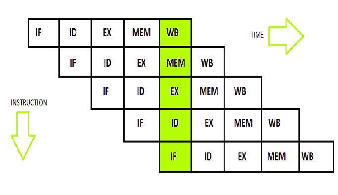

# RISC-V Verilog Implementation - 5 Stage Pipeline

## Overview

This project is an implementation of a **RISC-V processor** with a **standard 5-stage pipeline** architecture. The five stages include:

1. **Instruction Fetch (IF)**
2. **Instruction Decode (ID)**
3. **Execution (EX)**
4. **Memory Access (MEM)**
5. **Write Back (WB)**

The project was developed as part of a school assignment to better understand the inner workings of RISC-V architecture and pipeline design principles.

## Features

- **RISC-V 32-bit instruction set**: Supports a subset of the RV32I instruction set.
- **Five-stage pipeline**: Implements all the core stages of a standard CPU pipeline.
- **Hazard detection**: Simple hazard detection and forwarding logic to handle data dependencies.
- **Branch prediction**: Includes a basic branch prediction mechanism.
- **Memory and register file access**: Supports memory access instructions and register file operations.

## License and Usage
This project was developed as a school assignment, and while the code is provided free to use for learning and reference, it is strictly prohibited to use this code or its derivatives for any academic submission or coursework. Doing so would be considered academic dishonesty and a violation of school policies.

Please feel free to use this project to better understand RISC-V pipeline architecture, but respect academic integrity by ensuring it is not submitted for grades.

## Contributions
Since this project was primarily educational, contributions are not expected, but feel free to open issues or create pull requests if you have suggestions or improvements. Feedback is welcome!

## Disclaimer
This implementation is meant for educational purposes and may not cover all edge cases or optimizations found in production-grade processors.
